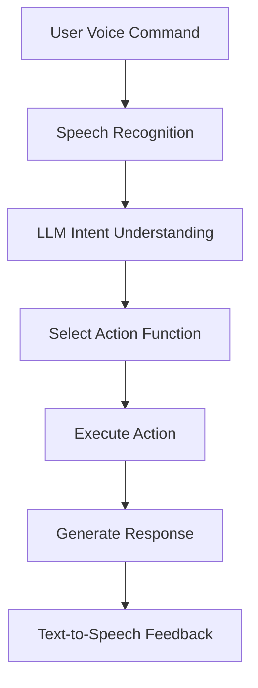

# 🐾 dog —— AI Assistant Core Framework

<div align="center">
  
</div>

This project is a **cross-platform AI assistant core framework**, designed to allow developers to build intelligent assistants with voice recognition, intent understanding, task scheduling, and autonomous execution capabilities through simple action function definitions and decorator configurations.

It is suitable for developing voice assistants like "Xiaoai Tongxue", robot control programs integrated with ROS, smart home control systems, and more.

---

## 🔧 Key Features

| Feature | Description |
|--------|-------------|
| ✅ Zero-parsing architecture | Automatically maps user instructions to action functions using decorators |
| ✅ Multi-modal input | Supports speech recognition + command line input |
| ✅ Simple action definition | Inherit from [Action](file://G:\desktop\dog\core\action.py#L9-L14) class and use [@Arguments](file://G:\desktop\dog\core\action.py#L18-L39) decorator |
| ✅ Context management | Supports conversation context recording and usage |
| ✅ Asynchronous task processing | Supports concurrent task scheduling and execution |
| ✅ Multi-backend support | Stores results via file system or Redis |
| ✅ Logging system | Colored output logs + file log rotation |

---

## 🌟 Main Modules

| Module | Functionality |
|--------|---------------|
| [listen](file://G:\desktop\dog\core\listen\listen.py#L0-L0) | Real-time speech recognition module based on DashScope ASR |
| [speek](file://G:\desktop\dog\core\speek\speek.py#L0-L0) | Text-to-speech synthesis module based on DashScope TTS |
| [seek](file://G:\desktop\dog\core\seek\seek.py#L0-L0) | LLM interface for intent understanding and task generation |
| [action](file://G:\desktop\dog\core\action.py#L0-L0) | Abstract base class and decorator for actions |
| [task](file://G:\desktop\dog\core\task.py#L0-L0) | Task scheduling and async execution mechanism |
| [register](file://G:\desktop\dog\core\register.py#L0-L0) | Action registration and auto-discovery |
| `backend` | Supports multiple storage backends (file, Redis) |
| [message](file://G:\desktop\dog\core\message.py#L0-L0) | Conversation history and context manager |
| [logger](file://G:\desktop\dog\core\logger.py#L0-L0) | Global logging system |

---

## 🧰 Quick Start

### Install Dependencies

```
bash
pip install -r requirements.txt
```
### Set Environment Variables

```bash
export DASHSCOPE_API_KEY=your_api_key
export LLM_MODEL=qwen-plus
```
### Run the Project

```bash
python aiframework/main.py
```
By default, it starts in voice recognition mode. You can speak or type commands such as:

- “Open browser”
- “Play music”

The AI will attempt to call appropriate functions based on your defined actions.

---

## 💡 Sample Action Definition

You only need to define a class that inherits from [Action](file://G:\desktop\dog\core\action.py#L9-L14), and decorate it with [@Arguments](file://G:\desktop\dog\core\action.py#L18-L39) to describe its parameters.

```python
from aiframework.core.action import Arguments, Action


@Arguments(
    parameters={
        "location": {"type": "string", "description": "Room name"},
        "state": {"type": "string", "description": "Switch state ('on'/'off')"}
    },
    required=["location", "state"]
)
class ControlLight(Action):
    def perform(self, arguments):
        location = arguments['location']
        state = arguments['state']
        # Your control logic here
        return f"{location} light has been turned {state}"
```
---

## 🧠 Workflow Overview


---

## 📁 Project Structure

```
core/
├── action.py                 # Base Action class & decorator
├── listen/                   # Speech recognition module
├── speek/                    # TTS module
├── seek/                     # LLM interface
├── task/                     # Task scheduler
├── register.py               # Action registry
├── backend/                  # Storage backends
├── message.py                # Message & context management
├── logger.py                 # Logging system
└── main.py                   # Entry point
```
---

## 📄 Build & Packaging

To package the project:

```bash
python setup.py sdist bdist_wheel
```
Install locally:

```bash
pip install -e .
```
---

## 📝 Notes

- Currently only Chinese documentation exists; this English version is newly added.
- Not yet published to PyPI, so pip installation is not supported yet.
- ROS support is not implemented yet; feel free to extend if needed.
- GUI and QR code sections are placeholders and can be updated later.

---

Would you like me to generate:
- CONTRIBUTING.md
- LICENSE (if not already present)
- A full docs/ directory structure with markdown files?

Let me know how I can help further!


---