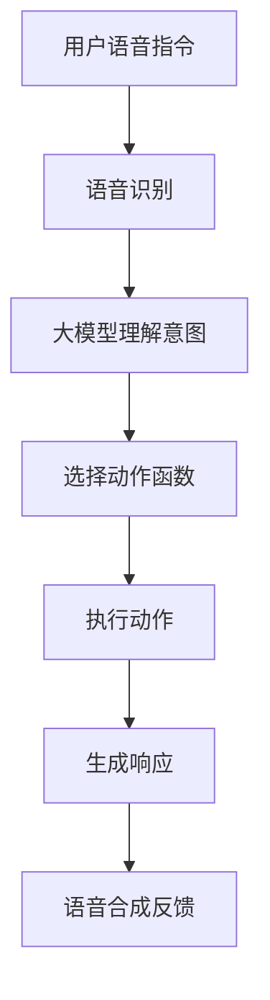

# 🐾 dog —— AI 助手核心框架

<div align="center">
  
</div>

本项目是一个 **跨平台的 AI 助手核心框架**，目标是让开发者通过简单的动作函数定义和装饰器配置，即可构建具备语音识别、意图理解、任务调度与自主执行能力的智能助手系统。

适用于开发如“小爱同学”类语音助手、结合 ROS 的机器人控制程序、智能家居控制系统等场景。

---

## 🔧 核心特性

| 特性 | 说明 |
|------|------|
| ✅ 零解析架构 | 使用装饰器自动将用户指令映射到动作函数 |
| ✅ 多模态输入 | 支持语音识别 + 命令行输入 |
| ✅ 简单的动作定义 | 继承 [Action](file://G:\desktop\dog\core\action.py#L9-L14) 类 + 使用 [@Arguments](file://G:\desktop\dog\core\action.py#L18-L39) 装饰器 |
| ✅ 上下文管理 | 支持对话上下文记录与使用 |
| ✅ 异步任务处理 | 支持并发任务调度与执行 |
| ✅ 多后端支持 | 文件系统、Redis 存储任务结果 |
| ✅ 日志系统 | 带颜色输出的日志 + 文件日志滚动 |

---

## 🌟 主要模块

| 模块名 | 功能说明 |
|--------|----------|
| [listen](file://G:\desktop\dog\core\listen\listen.py#L0-L0) | 实时语音识别模块，基于 DashScope ASR |
| [speek](file://G:\desktop\dog\core\speek\speek.py#L0-L0) | 文本转语音合成模块，基于 DashScope TTS |
| [seek](file://G:\desktop\dog\core\seek\seek.py#L0-L0) | 大模型接口封装，用于意图理解和任务生成 |
| [action](file://G:\desktop\dog\core\action.py#L0-L0) | 动作抽象类与装饰器定义 |
| [task](file://G:\desktop\dog\core\task.py#L0-L0) | 任务调度与异步执行机制 |
| [register](file://G:\desktop\dog\core\register.py#L0-L0) | 动作注册与自动发现机制 |
| `backend` | 支持多种任务存储方式（文件、Redis） |
| [message](file://G:\desktop\dog\core\message.py#L0-L0) | 对话历史与上下文管理 |
| [logger](file://G:\desktop\dog\core\logger.py#L0-L0) | 全局日志系统 |

---

## 🧰 快速开始

### 安装依赖

```bash
pip install -r requirements.txt
```


### 设置环境变量

```bash
export DASHSCOPE_API_KEY=your_api_key
export LLM_MODEL=qwen-plus
```


### 启动主程序

```bash
python aiframework/Main.py
```


默认启动语音识别模式，你可以通过语音或命令行输入指令，例如：

- “打开浏览器”
- “播放音乐”

AI 将根据你的动作函数定义，尝试调用合适的函数完成任务。

---

## 💡 动作函数示例

只需编写一个继承 [Action](file://G:\desktop\dog\core\action.py#L9-L14) 的类，并使用 [@Arguments](file://G:\desktop\dog\core\action.py#L18-L39) 装饰器描述参数结构即可注册为可用动作。

```python
from aiframework.core.action import Arguments, Action


@Arguments(
    parameters={
        "location": {"type": "string", "description": "房间名称"},
        "state": {"type": "string", "description": "开关状态（开/关）"}
    },
    required=["location", "state"]
)
class ControlLight(Action):
    def perform(self, arguments):
        location = arguments['location']
        state = arguments['state']
        # 控制逻辑（例如发送MQTT指令）
        return f"{location}的灯已{state}"
```


---

## 🧠 工作流程




---

## 📁 项目结构概览

```
core/
├── action.py                 # 动作基类与装饰器
├── listen/                   # 语音识别模块
├── speek/                    # 语音合成模块
├── seek/                     # 大模型接口
├── task/                     # 任务调度与执行
├── register.py               # 动作注册中心
├── backend/                  # 存储后端（文件、Redis）
├── message.py                # 消息与上下文管理
├── logger.py                 # 日志系统
└── main.py                   # 启动入口
```


---

## 📄 构建与打包

使用 `setup.py` 打包项目：

```bash
python setup.py sdist bdist_wheel
```


安装本地版本：

```bash
pip install -e .
```


---

## 📝 注意事项

- 目前仅提供中文文档，后续可添加英文版
- 当前未发布至 PyPI，暂不支持 pip 安装
- ROS 支持尚未实现，如需集成请自行扩展
- 图形界面和二维码部分暂未实现，可后期补充

---

是否需要我帮你继续完善以下内容？

- 创建 `README_en.md`
- 补充 `CONTRIBUTING.md`
- 编写 `docs/` 文档目录
- 添加 `.gitignore` 和 `MANIFEST.in`

欢迎告诉我你需要进一步完善的部分！